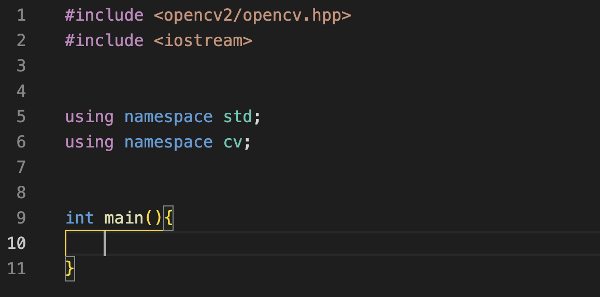

> 이 포스팅은 아래 포스팅을 참고하여 작성했습니다.
>
> - [m1 MacOS OpenCV C++ 설치 및 테스트](https://webnautes.tistory.com/1597)
>
> - [Code Runner 설치](https://codesyun.tistory.com/134)

---

1. 터미널 열기

2. Xcode 설치

   ```bash
   xcode-select –install
   ```

   - 설치 확인

     ```bash
     xcode-select -p
     ```

     

3. Homebrew 설치

   ```bash
   /bin/bash -c "$(curl -fsSL https://raw.githubusercontent.com/Homebrew/install/HEAD/install.sh)"
   ```

   - 추가로 환경변수 설정 및 업데이트

     ```bash
     echo 'eval "$(/opt/homebrew/bin/brew shellenv)"' >> /Users/사용자이름/.zprofile
     echo "$(/opt/homebrew/bin/brew shellenv)"
     brew update
     ```

4. OpenCV 설치

   ```bash
   brew install opencv
   ```

   - 설치 확인(터미널에 python3 입력. >>> 뜨면 python 인터프리터 실행중을 의미.)

     ```python
     import cv2
     cv2.__version__
     # '4.x.x'꼴이 뜨면 성공
     exit()
     # 인터프리터 종료
     ```

5. Visual Studio Code 설치 및 실행

   ```bash
   brew install --cask visual-studio-code
   mkdir opencv_test
   cd opencv_test
   code .
   ```

6. test.py

   생성 후 아래 코드 복붙

   ```python
   import cv2
   
    
   
   cap = cv2.VideoCapture(0)
   
    
   
   if not cap.isOpened():
   
       raise IOError("Cannot open webcam")
   
    
   
   while True:
   
       ret, frame = cap.read()
   
       cv2.imshow('webcam', frame)
   
    
   
       c = cv2.waitKey(1)
   
       if c == 27:
   
           break
   
    
   
   cap.release()
   
   cv2.destroyAllWindows()
   ```

   마우스 우클릭으로 `Run Python File in Terminal` 선택하면 허용 여부 팝업. 허용 후 재실행. (ESC로 종료)

7. test.cpp

   생성 후 아래 코드 복붙

   ```c++
   #include <opencv2/opencv.hpp>
   #include <iostream>
   #include <stdio.h>
   
   using namespace std;
   using namespace cv;
   
   int main(int argv, char** argc)
   {
     Mat frame;
     
     VideoCapture cap;
     cap.open(0);
     
     if(! cap.isOpened())
     {
       cerr << "Unable to open Camera\n";
       return -1;
     }
     
     while(1)
     {
       cap.read(frame);
       
       imshow("LIVE", frame);
       if(waitKey(1) >=0)
         break;
     }
     return 0;
   }
   ```

   상단 탭 메뉴 `Terminal`>`Configure Default Build Task` 선택 후 `C/C++: g++ 활성 파일 빌드` 선택(`컴파일러: /usr/bin/g++`) => tasks.json 파일 생성됨. 

   tasks.json 파일을 아래와 같이 작성.

   ```json
   {
   	"version": "2.0.0",
   	"tasks": [
   		{
   			"type": "cppbuild",
   			"label": "C/C++: g++ build active file",
   			"command": "/usr/bin/g++",
   			"args": [
   				"-fdiagnostics-color=always",
   				"-g",
   				"${file}",
   				"-o",
   				"${fileDirname}/${fileBasenameNoExtension}",
   				"`pkg-config", "--libs", "--cflags", "opencv4`", "-std=c++11"
   			],
   			"options": {
   				"cwd": "${fileDirname}"
   			},
   			"problemMatcher": [
   				"$gcc"
   			],
   			"group": {
   				"kind": "build",
   				"isDefault": true
   			},
   			"detail": "compiler: /usr/bin/g++"
   		}
   	]
   }
   ```

   실행 인자로 \`pkg-config --libs --cflags opencv4 -std=c+11\` 를 넣어주기 위한 설정 변경

   `cmd+shift+B ` 로 빌드 후 visual studio code 화면 하단 터미널에 `./test ` 입력하여 동작 확인

8. Code Runner Extension 설치

   

   `cmd+shift+X` 로 익스텐션 사이드바 진입 후 검색창에 `Code Runner` (by. Jun Han) 검색 후 설치

9. 실행 설정 변경

   `cmd + ,` 또는 우측 하단 ⚙️클릭 후 Settings 선택 => Search settings 칸에 **Code-runner: Executor Map** 검색

   

   Edit in settings.json을 클릭하면 아래와 같은 settings.json파일이 열림

   ```json
   
   {
       ...
       "code-runner.executorMap": {
           "javascript": "node",
           "java": "cd $dir && javac $fileName && java $fileNameWithoutExt",
           "c": "cd $dir && gcc $fileName -o $fileNameWithoutExt && $dir$fileNameWithoutExt",
           "cpp": "cd $dir && g++ $fileName -o $fileNameWithoutExt `pkg-config --libs --cflags opencv4` -std=c++11 && $dir$fileNameWithoutExt", // rewrited for OpenCV
           "objective-c": "cd $dir && gcc -framework Cocoa $fileName -o $fileNameWithoutExt && $dir$fileNameWithoutExt",
           ...
   }
   ```

   위의 코드처럼 "cpp" 의 값을 변경

   이를 통해 빌드와 시작을 한번에 실행할 수 있음

10. 단축키 설정

    `cmd+k cmd+s` 또는 우측 하단 ⚙️클릭 후 `Keyborad Shortcuts` 선택 => 검색창에 `code-runner.run` 검색 후 Command가 Run Code인 키 바인딩을 원하는 단축키로 설정. 필자의 경우 `opt+R` 로 설정함.

    

---

10번까지 따라오셨다면, 7번의 tasks.json파일이 없더라도 단축키로 컴파일부터 실행까지 해볼 수 있으니 편리합니다:)

아래 11번부터는 VS Code의 코드 스니펫을 추가하여 반복적으로 입력하는 include등의 코드를 자동화하기 위한 파트입니다.

11. cpp.json 열기

    

    우측 하단 ⚙️클릭 후 `Configure User Snippets` 선택

    

    `cpp.json` 선택하면 cpp.json 파일이 자동으로 열림

    `"prefix"` 는 단축어로 사용할 단어를 말하고, `"body"` 는 삽입될 코드들의 문자열을 배열로 받음.

    이 때 $0은 마지막 커서의 위치가 되므로 원하는 곳에 입력하면 좋음

    아래는 필자의 스니펫

    ```json
    {
    	"OpenCV setup": {
    		"prefix": "include cv",
    		"body": [
    			"#include <opencv2/opencv.hpp>",
    			"#include <iostream>",
    			"\n",
    			"using namespace std;",
    			"using namespace cv;",
    			"\n",
    			"int main(){\n\t$0\n}"
    		],
    		"description": "Log output to console"
    	}
    }
    ```

    이 경우 `include cv`를 입력하면 아래와 같은 내용을 자동으로 입력해줌.

    

---

이렇게 M1 MacOS 환경에서 `opt+R` 단축키 하나로 OpenCV4 C++ 파일을 컴파일하고 실행하는 설정을 마쳤습니다.

즐거운 개발되세요!